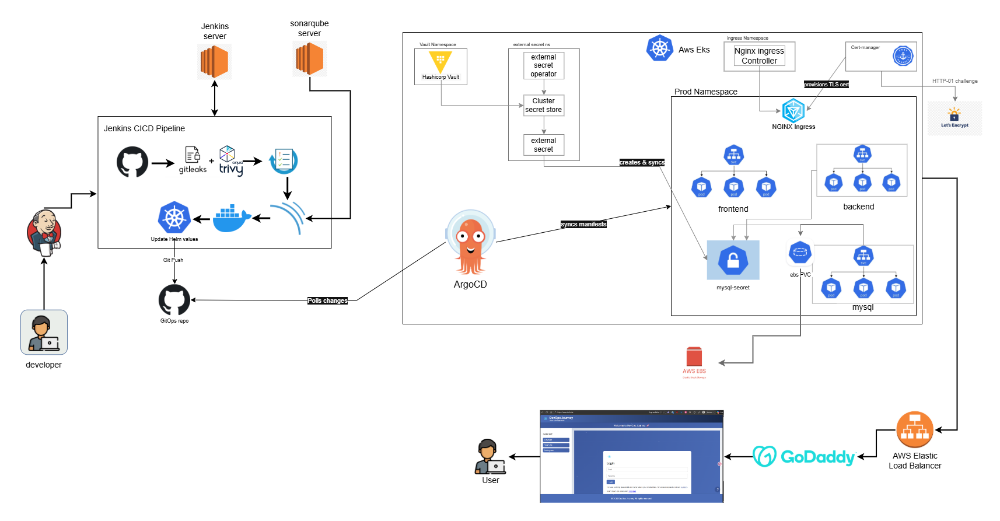

# GitOps based Continuous Delivery Plattform with ArgoCD and HashiCorp Vault

Built a production-grade DevSecOps pipeline that automates the entire software delivery lifecycle with security baked in at every stage. The application is a full-stack Node.js user management system with a React frontend, Node.js REST API, and MySQL database deployed on AWS EKS using Kubernetes and Helm. Every code push triggers a Jenkins pipeline that runs secret scanning with Gitleaks, vulnerability scanning with Trivy, and static code analysis with SonarQube before building and pushing Docker images to Docker Hub. Image tags are automatically updated in a separate GitOps repository, which ArgoCD monitors to synchronize changes to the Kubernetes cluster within minutes. Secrets are managed using HashiCorp Vault integrated with the External Secrets Operator, ensuring no sensitive credentials ever touch Git. All endpoints are secured with TLS via cert-manager and Let's Encrypt, and MySQL data is persisted on AWS EBS volumes with a retain policy.
---
A complete end-to-end guide for setting up the full DevSecOps pipeline including infrastructure, CI/CD, GitOps, secrets management, and TLS.
---

## Table of Contents

1. [Project Overview](#1-project-overview)
2. [Architecture](#2-architecture)
3. [Prerequisites](#3-prerequisites)
4. [AWS EKS Cluster Setup](#4-aws-eks-cluster-setup)
5. [Jenkins CI Setup](#5-jenkins-ci-setup)
6. [SonarQube Setup](#6-sonarqube-setup)
7. [Docker Hub](#7-docker-hub)
8. [Kubernetes Add-ons](#8-kubernetes-add-ons)
9. [HashiCorp Vault + ESO](#9-hashicorp-vault--eso)
10. [Helm Chart & GitOps Repo](#10-helm-chart--gitops-repo)
11. [ArgoCD Setup](#11-argocd-setup)
12. [TLS with cert-manager](#12-tls-with-cert-manager)
13. [Jenkins Pipeline](#13-jenkins-pipeline)
14. [Verify End-to-End](#14-verify-end-to-end)
15. [Repository Structure](#15-repository-structure)

---
## 📐 High-Level Architecture

---

## 1. Project Overview

This project deploys a full-stack Node.js user management application on AWS EKS using a production-grade DevSecOps pipeline. Every code push to GitHub triggers a Jenkins pipeline that scans for secrets, vulnerabilities, and code quality issues before building Docker images and updating the GitOps repository. ArgoCD then automatically syncs the changes to the Kubernetes cluster.

### Tech Stack

| Layer | Tool |
|---|---|
| Cloud | AWS EKS |
| Application | Node.js (backend), React (frontend), MySQL 8 |
| Container Registry | Docker Hub |
| CI Pipeline | Jenkins |
| Secret Scanning | Gitleaks |
| Filesystem/Image Scanning | Trivy |
| Static Code Analysis | SonarQube |
| Container Orchestration | Kubernetes (EKS) |
| Package Manager | Helm |
| GitOps | ArgoCD |
| Secrets Management | HashiCorp Vault + External Secrets Operator |
| Ingress | Nginx Ingress Controller |
| TLS | cert-manager + Let's Encrypt |
| Storage | AWS EBS CSI Driver |

---

## 2. Architecture

```
Developer pushes code
        │
        ▼
┌─────────────────────────────────────────────┐
│              Jenkins Pipeline               │
│                                             │
│  1. Checkout code + generate SHORT_TAG      │
│  2. Gitleaks  → secret scanning             │
│  3. Trivy FS  → filesystem vuln scan        │
│  4. SonarQube → static code analysis        │
│  5. Docker Build (backend + frontend)       │
│  6. Trivy Image → container vuln scan       │
│  7. Docker Push → Docker Hub                │
│  8. yq update values.yaml in GitOps repo    │
└─────────────────────────────────────────────┘
        │
        ▼ (git push to GitOps repo)
┌─────────────────────────────────────────────┐
│                  ArgoCD                     │
│                                             │
│  Watches: fasih6/three-tier-nodejs-gitops   │
│  Runs:    helm template → kubectl apply     │
│  Syncs:   prod namespace on EKS             │
└─────────────────────────────────────────────┘
        │
        ▼
┌─────────────────────────────────────────────┐
│            AWS EKS (prod namespace)         │
│                                             │
│  ┌──────────┐  ┌──────────┐  ┌──────────┐   │
│  │ Frontend │  │ Backend  │  │  MySQL   │   │
│  │ (Nginx)  │→ │ (Node.js)│→ │  (SS)    │   │
│  └──────────┘  └──────────┘  └──────────┘   │
│        ↑              ↑            ↑        │
│        └──────────────┴────────────┘        │
│                    Ingress                  │
│              (nginx + TLS)                  │
│                                             │
│  mysql-secret ← ESO ← Vault                 │
└─────────────────────────────────────────────┘
```

### Traffic Flow

```
Internet
    │
    ▼
Route 53 (DNS) → fasih.site / www.fasih.site
    │
    ▼
AWS Load Balancer
    │
    ▼
Nginx Ingress Controller
    ├── /api      → backend-svc:5000
    ├── /metrics  → backend-svc:5000
    └── /         → frontend-svc:80
```

---

## 3. Prerequisites

### Local tools required

```bash
# Verify these are installed
aws --version          # AWS CLI v2
kubectl version        # kubectl
helm version           # Helm v3+
eksctl version         # eksctl (for EKS)
git --version          # Git
docker --version       # Docker
```

### AWS requirements

- AWS account with permissions to create EKS, EC2, EBS, IAM roles
- Route 53 hosted zone for your domain
- AWS CLI configured: `aws configure`

### GitHub repositories

Create two repositories:

| Repository | Contents |
|---|---|
| `your-username/3-tier-NodejsApp-project` | Application source code |
| `your-username/three-tier-nodejs-gitops` | Helm chart + values.yaml |

---

## 4. AWS EKS Cluster Setup

### Create the EKS cluster

```bash
eksctl create cluster \
  --name three-tier-cluster \
  --region us-east-1 \
  --nodegroup-name standard-workers \
  --node-type t3.medium \
  --nodes 3 \
  --nodes-min 2 \
  --nodes-max 4 \
  --managed
```

This takes approximately 15-20 minutes.

### Configure kubectl

```bash
aws eks update-kubeconfig \
  --region us-east-1 \
  --name three-tier-cluster
```

Verify:

```bash
kubectl get nodes
# Should show 3 nodes in Ready state
```

### Install the AWS EBS CSI Driver

Required for persistent storage (MySQL data, Vault data).

```bash
# Create IAM role for EBS CSI driver
eksctl create iamserviceaccount \
  --name ebs-csi-controller-sa \
  --namespace kube-system \
  --cluster three-tier-cluster \
  --attach-policy-arn arn:aws:iam::aws:policy/service-role/AmazonEBSCSIDriverPolicy \
  --approve \
  --role-only \
  --role-name AmazonEKS_EBS_CSI_DriverRole

# Install the driver
eksctl create addon \
  --name aws-ebs-csi-driver \
  --cluster three-tier-cluster \
  --service-account-role-arn arn:aws:iam::<your-account-id>:role/AmazonEKS_EBS_CSI_DriverRole
```

### Create the StorageClass

```yaml
# storageclass.yaml
apiVersion: storage.k8s.io/v1
kind: StorageClass
metadata:
  name: ebs-sc
provisioner: ebs.csi.aws.com
volumeBindingMode: WaitForFirstConsumer
reclaimPolicy: Retain
```

```bash
kubectl apply -f storageclass.yaml
kubectl get storageclass
```

### Create the prod namespace

```bash
kubectl create namespace prod
```

---

## 5. Jenkins CI Setup

### Install Jenkins on EC2

Launch an EC2 instance (t3.medium, Ubuntu 22.04) and run:

```bash
# Install Java
sudo apt update
sudo apt install -y openjdk-17-jdk

# Install Jenkins
curl -fsSL https://pkg.jenkins.io/debian-stable/jenkins.io-2023.key | \
  sudo tee /usr/share/keyrings/jenkins-keyring.asc > /dev/null

echo deb [signed-by=/usr/share/keyrings/jenkins-keyring.asc] \
  https://pkg.jenkins.io/debian-stable binary/ | \
  sudo tee /etc/apt/sources.list.d/jenkins.list > /dev/null

sudo apt update
sudo apt install -y jenkins
sudo systemctl start jenkins
sudo systemctl enable jenkins
```

### Install required tools on the Jenkins server

```bash
# Docker
sudo apt install -y docker.io
sudo usermod -aG docker jenkins

# Trivy
curl -sfL https://raw.githubusercontent.com/aquasecurity/trivy/main/contrib/install.sh | \
  sudo sh -s -- -b /usr/local/bin

# Gitleaks
wget https://github.com/gitleaks/gitleaks/releases/latest/download/gitleaks_linux_amd64.tar.gz
tar -xzf gitleaks_linux_amd64.tar.gz
sudo mv gitleaks /usr/local/bin/

# yq (for updating values.yaml)
sudo wget https://github.com/mikefarah/yq/releases/latest/download/yq_linux_amd64 \
  -O /usr/local/bin/yq
sudo chmod +x /usr/local/bin/yq

# kubectl
curl -LO "https://dl.k8s.io/release/$(curl -L -s https://dl.k8s.io/release/stable.txt)/bin/linux/amd64/kubectl"
sudo install -o root -g root -m 0755 kubectl /usr/local/bin/kubectl
```

### Install Jenkins Plugins

Navigate to `Manage Jenkins → Plugins → Available` and install:

- Docker Pipeline
- SonarQube Scanner
- Git
- Pipeline
- Credentials Binding

### Configure Jenkins Credentials

Navigate to `Manage Jenkins → Credentials → Global` and add:

| ID | Type | Description |
|---|---|---|
| `docker-cred` | Username/Password | Docker Hub credentials |
| `github-cred` | Username/Password | GitHub username + Personal Access Token |
| `sonar-token` | Secret Text | SonarQube authentication token |

### Configure SonarQube Scanner tool

Navigate to `Manage Jenkins → Tools → SonarQube Scanner` and add an installation named `sonar-scanner`.

### Configure SonarQube server

Navigate to `Manage Jenkins → System → SonarQube servers` and add:

- Name: `sonar`
- Server URL: `http://<sonarqube-server-ip>:9000`
- Token: select your `sonar-token` credential

---

## 6. SonarQube Setup

### Install SonarQube on EC2

Launch a separate EC2 instance (t3.medium, Ubuntu 22.04):

```bash
docker run -d -p 9000:9000 sonarqube:community
```

SonarQube will be accessible at `http://<ec2-ip>:9000`. Default credentials: `admin` / `admin`.

### Generate a token

Navigate to `My Account → Security → Generate Token` and copy the token. Add it to Jenkins credentials as `sonar-token`.

---

## 7. Docker Hub

### Create repositories

Log in to Docker Hub and create two public repositories:

- `your-username/backend`
- `your-username/frontend`

### Add credentials to Jenkins

Add your Docker Hub username and password/access token as a `docker-cred` credential in Jenkins (done in Section 5).

---

## 8. Kubernetes Add-ons

### Install Nginx Ingress Controller

```bash
helm repo add ingress-nginx https://kubernetes.github.io/ingress-nginx
helm repo update

helm install ingress-nginx ingress-nginx/ingress-nginx \
  --namespace ingress-nginx \
  --create-namespace
```

Get the external Load Balancer address:

```bash
kubectl get svc -n ingress-nginx ingress-nginx-controller
# Note the EXTERNAL-IP — point your DNS to this
```

### Point DNS to the Load Balancer

In AWS Route 53, create CNAME records:

- `fasih.site` → Load Balancer DNS
- `www.fasih.site` → Load Balancer DNS
- `argocd.fasih.site` → Load Balancer DNS

---

## 9. HashiCorp Vault + ESO

[vault](hashicorp-vault-setup/README.md)
---

## 10. ArgoCD Setup

### Install ArgoCD

```bash
kubectl create namespace argocd

kubectl apply -n argocd \
  -f https://raw.githubusercontent.com/argoproj/argo-cd/stable/manifests/install.yaml
```

Wait for all pods to be ready:

```bash
kubectl get pods -n argocd -w
```

### Get the initial admin password

```bash
kubectl get secret argocd-initial-admin-secret \
  -n argocd \
  -o jsonpath='{.data.password}' | base64 -d
```

### Create the ArgoCD Application

```yaml
# argocd-app.yaml
apiVersion: argoproj.io/v1alpha1
kind: Application
metadata:
  name: three-tier-nodejs
  namespace: argocd
spec:
  project: default
  source:
    repoURL: https://github.com/your-username/three-tier-nodejs-gitops.git
    targetRevision: main
    path: .
    helm:
      valueFiles:
        - values.yaml
  destination:
    server: https://kubernetes.default.svc
    namespace: prod
  syncPolicy:
    automated:
      prune: true
      selfHeal: true
    syncOptions:
      - CreateNamespace=true
```

```bash
kubectl apply -f argocd-app.yaml
```

### Create ArgoCD Ingress

```yaml
# argocd-ingress.yaml
apiVersion: networking.k8s.io/v1
kind: Ingress
metadata:
  name: argocd-server-ingress
  namespace: argocd
  annotations:
    cert-manager.io/cluster-issuer: letsencrypt-prod
    nginx.ingress.kubernetes.io/ssl-redirect: "true"
    nginx.ingress.kubernetes.io/backend-protocol: "HTTPS"
spec:
  ingressClassName: nginx
  rules:
  - host: argocd.fasih.site
    http:
      paths:
      - path: /
        pathType: Prefix
        backend:
          service:
            name: argocd-server
            port:
              number: 443
  tls:
  - hosts:
    - argocd.fasih.site
    secretName: argocd-tls
```

```bash
kubectl apply -f argocd-ingress.yaml
```

---

## 12. TLS with cert-manager

### Install cert-manager

```bash
helm repo add jetstack https://charts.jetstack.io
helm repo update

helm install cert-manager jetstack/cert-manager \
  --namespace cert-manager \
  --create-namespace \
  --set installCRDs=true
```

Verify:

```bash
kubectl get pods -n cert-manager
```

### Create ClusterIssuer

```yaml
# cert-issuer.yaml
apiVersion: cert-manager.io/v1
kind: ClusterIssuer
metadata:
  name: letsencrypt-prod
spec:
  acme:
    server: https://acme-v02.api.letsencrypt.org/directory
    email: your-email@example.com
    privateKeySecretRef:
      name: letsencrypt-prod
    solvers:
      - http01:
          ingress:
            class: nginx
```

```bash
kubectl apply -f cert-issuer.yaml

# Verify issuer is ready
kubectl get clusterissuer letsencrypt-prod
# Should show READY: True
```

Once the Ingress resources exist (created by ArgoCD syncing the Helm chart), cert-manager will automatically request and renew TLS certificates from Let's Encrypt.

---
### Create a Jenkins job

1. Click **New Item** → **Pipeline**
2. Under **Pipeline**, select **Pipeline script from SCM**
3. Set SCM to **Git** and enter your app repo URL
4. Set branch to `*/main`
5. Set Script Path to `Jenkinsfile`
6. Save and click **Build Now**

---

## 13. Verify End-to-End

Run through this checklist after setup is complete.

### Infrastructure

```bash
# Nodes healthy
kubectl get nodes

# All namespaces present
kubectl get namespaces
# Should include: prod, vault, argocd, external-secrets, ingress-nginx, cert-manager
```

### Vault

```bash
# Vault pod running and ready
kubectl get pods -n vault

# Secret exists in Vault
kubectl exec -it -n vault vault-0 -- vault kv get secret/prod/mysql
```

### ESO and Secrets

```bash
# ClusterSecretStore healthy
kubectl get clustersecretstore vault-backend
# STATUS: Valid, READY: True

# ExternalSecret synced
kubectl get externalsecret -n prod
# STATUS: SecretSynced, READY: True

# Kubernetes Secret exists
kubectl get secret mysql-secret -n prod

# Decode and verify value
kubectl get secret mysql-secret -n prod \
  -o jsonpath='{.data.MYSQL_ROOT_PASSWORD}' | base64 -d
```

### Application

```bash
# All pods running in prod
kubectl get pods -n prod
# frontend, backend (x3 each), mysql-0 should all be Running

# All services exist
kubectl get svc -n prod

# Ingress has an address
kubectl get ingress -n prod
```

### ArgoCD

```bash
kubectl get application three-tier-nodejs -n argocd
# SYNC STATUS: Synced   HEALTH STATUS: Healthy
```

### TLS

```bash
# Certificate issued
kubectl get certificate -n prod
# Should show READY: True

kubectl get certificate -n argocd
# Should show READY: True
```

### Application in browser

Open `https://fasih.site` — you should see the frontend with a valid padlock (TLS) in the browser.

### Trigger a full pipeline run

1. Make a small code change and push to the app repo
2. Jenkins pipeline triggers automatically
3. All stages pass (Gitleaks, Trivy, SonarQube, Docker build/push)
4. `values.yaml` in the GitOps repo is updated with the new image tag
5. ArgoCD detects the change and syncs within 3 minutes
6. New pods roll out with zero downtime

---

## 15. Repository Structure

### Application repo (`3-tier-NodejsApp-project`)

```
3-tier-NodejsApp-project/
├── Jenkinsfile
├── api/                    # Node.js backend
│   ├── Dockerfile
│   ├── package.json
│   └── src/
└── client/                 # React frontend
    ├── Dockerfile
    ├── package.json
    └── src/
```

### GitOps repo (`three-tier-nodejs-gitops`)

```
three-tier-nodejs-gitops/
├── Chart.yaml
├── values.yaml             # Updated by Jenkins on every build
└── templates/
    ├── _helpers.tpl
    ├── backend.yaml
    ├── frontend.yaml
    ├── mysql.yaml
    ├── ingress.yaml
    └── NOTES.txt
```

### Kubernetes manifests (applied once, not in Helm)

```
k8s-manifests/
├── argocd-app.yaml         # ArgoCD Application
├── argocd-ingress.yaml     # ArgoCD UI Ingress
├── cert-issuer.yaml        # Let's Encrypt ClusterIssuer
├── storageclass.yaml       # EBS StorageClass
├── secret-store.yaml       # ESO ClusterSecretStore
└── external-secret.yaml    # ESO ExternalSecret
```

---

*This project demonstrates a production-grade DevSecOps pipeline with multi-layer security scanning, GitOps-driven deployments, and secrets management using HashiCorp Vault on AWS EKS.*


